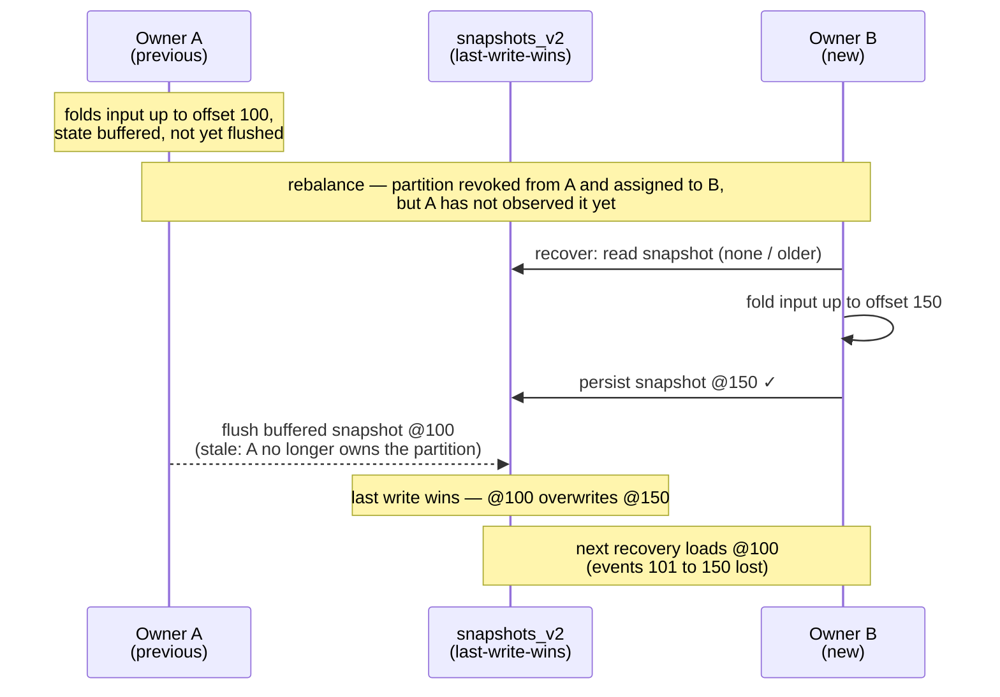

Design notes for the compare-and-set snapshot mode of `kafka-flow-persistence-cassandra`
(`CassandraSnapshots.withSchema(compareAndSet = true)`) — the mechanism and its subtleties. The Kafka
backend solves the same problem differently — see [Kafka single-writer design](kafka-single-writer-design.md).

## Problem

[kafka-flow#732](https://github.com/evolution-gaming/kafka-flow/issues/732): consumer-group ownership
of the input topic does not extend to the snapshot store. During a rebalance a previous owner that has
not yet observed the revocation (network issue, GC pause, slow poll loop) keeps folding events and
flushing snapshots alongside the new owner. The snapshots table is last-write-wins, so a stale
snapshot can overwrite a newer one; the next recovery loads stale state and loses the events between
the two snapshots, even though their input offsets were committed. Overlaps of tens of seconds have
been observed in production.



## Mechanism: compare-and-set

The stored offset is a per-key [fencing token](https://martin.kleppmann.com/2016/02/08/how-to-do-distributed-locking.html):
every write asserts that the stored offset is not greater than the one being written, so the
newest-by-offset writer wins regardless of who it is. Unlike Kafka, Cassandra offers a conditional
write (a Paxos lightweight transaction), so the fence is per write rather than a transaction binding
the input-offset commit.

A snapshot write (`CassandraSnapshots.persistCompareAndSet`) is

```sql
UPDATE snapshots_v2 SET ... , offset = :offset WHERE <key> IF offset <= :offset
```

The first write of a key finds no row, so the conditional `UPDATE` does not apply; it falls back to
`INSERT ... IF NOT EXISTS`. If that loses a race to a concurrent insert, the conditional `UPDATE` is
retried once, so the newest snapshot still wins a first-write race. A rejected write raises
`SnapshotWriteConflict`. A not-applied result reports the stored `offset` when Cassandra returns it and
treats its absence (or a null) as "row absent".

This first-write path is the one place a persist is **not** a single atomic compare-and-set — it is a
compound of separate Paxos transactions with interleaving gaps. It is still safe by construction: both
`UPDATE`s are offset-gated and `INSERT ... IF NOT EXISTS` only ever writes to an absent cell (nothing to
overwrite), so no interleaving can produce a stale overwrite. The only deviation from the atomic
abstraction is a *spurious* conflict — the retry finding the row gone because a TTL reap (or a
last-write-wins hard delete) removed it between the `INSERT` and the retry — which is benign: the flow
recovers on its next flush.

The guard is per **key** (per row), which is the right granularity: #732 corruption is per key, keys
are independent, and per-key monotonic durability is exactly what prevents it. The conditional write
is linearizable per partition key (Paxos), so concurrent writers to one key are correctly ordered
without relying on clock synchronisation.

## Delete

In this persist-only mode a delete is an ordinary `DELETE` (last-write-wins): the `IF offset <= :offset`
guard protects *persists*, not deletes. A lagging zombie can therefore still resurrect a just-deleted key
at a lower offset. Gating deletes on an offset (an offset-carrying logical tombstone) is the separate
**safe-delete** layer stacked on top of this one — it is intentionally out of scope here, because it
forces a source-breaking `SnapshotWriteDatabase.delete(key, offset)` change.

## The replay window

A re-persist is checked against an offset that, just after recovery, can legitimately trail the key's own
stored snapshot. The partition resumes from the committed offset `C` (the minimum offset still held
across all of its keys); a single slow key can hold `C` well below a fast key's durable snapshot offset
`X` (the offset-lags-state invariant only guarantees `C <= X`). On recovery the partition's processing
offset starts at `C`, while the recovered snapshot's offset is `X`.

The concern is that, in this window, a re-derived snapshot for a fast key could be persisted at the
replayed offset (`< X`); `IF offset <= X` would reject it, **crashing the legitimate owner** with a
`SnapshotWriteConflict` that reads as if another writer owned the key — a liveness problem (the owner
fences *itself*), not a safety one (the durable snapshot stays at `X`). This does not happen, because the
re-derivation never occurs: `SnapshotFold` deduplicates replayed records by offset
(`record.offset > snapshot.offset`), so events `<= X` dispatched to a key recovered at `X` are dropped
before the fold. The key's buffered snapshot stays at the high-water `X` (still `persisted`), the flush
is a no-op, and no write below `X` is ever attempted. The compare-and-set guard therefore never trips on
the legitimate owner during replay; the offset dedup that protects it is pre-existing and shared by every
snapshot store, not specific to this mode.

That covers the persist — the only offset-gated write in this layer. A timer-driven *tick-delete* would
bypass the `SnapshotFold` offset filter, but a delete here is a plain last-write-wins `DELETE`
(unfenced), so it too cannot self-fence. Once the safe-delete layer stacked on top gates deletes on an
offset, the tick-delete reopens this window — dedup does not cover it — which is why that layer also
keeps the in-memory snapshot buffer monotonic in offset.

## Equal-offset writes and determinism

`IF offset <= :offset` admits an *equal* offset, so a stale writer holding exactly the stored offset is
not detected. This is deliberate. The legitimate owner can act at an offset it has already stored — a
re-persist of the high-water `X` equals the stored offset, and a strict `<` would reject it and fence the
owner against itself. Admitting equal is safe not because the new value is identical but because a
same-offset write does not move the recovery point — unlike a lower-offset write it cannot drop committed
events (#732). The *records* folded into any two snapshots at the same offset are the same, so a
same-offset re-persist differs at most in time-driven tick state, never in event data. Deterministic,
replayable folds are therefore a precondition of the CAS mode (as they already are of recovery generally).

## Consistency

The lightweight transaction reaches consensus at the *serial* consistency level, which is distinct
from the read/write levels in `ConsistencyOverrides` and defaults to `SERIAL` (a cross-datacenter
quorum). `ConsistencyOverrides.write` governs only the transaction's commit phase, not its consensus.
For single-datacenter partition ownership (the common case) set the scassandra client's
`query.serial-consistency = LOCAL_SERIAL` to keep the Paxos rounds in-DC; otherwise every conditional
write pays a cross-datacenter round-trip (a delete is a plain quorum write here, so it is
unaffected). Recovery reads at `ConsistencyOverrides.read`;
a serial read is not required, because `R + W > N` makes a non-serial read see every committed
snapshot, and a still-in-flight write — one whose `persist` has not completed — is safe to miss
(recovery re-folds from the committed offset).

Compare-and-set does require read and write consistency at `QUORUM` or stronger (so `R + W > N`).
For single-datacenter ownership, `LOCAL_QUORUM` at both levels satisfies `R + W > N` within the
local DC and pairs with `LOCAL_SERIAL`. What matters is access locality — a key's writers and its
recovery read all in one DC — not the replication footprint, which may still span DCs for DR. The
conditional write reaches consensus on a serial quorum but *materialises* at `ConsistencyOverrides.write`;
with a weaker write level a (non-serial) `QUORUM` recovery read can miss the newest committed snapshot
even with no in-flight Paxos, reintroducing #732 on the read side — which the write-side fence does not
heal. This is not a default: `ConsistencyOverrides` is empty unless you set it, so the snapshot table
inherits the session's default level (often `LOCAL_ONE`) — you must configure read and write to a
quorum. Keep `R + W > N` within one consistency domain and a key's Paxos in one DC: the `LOCAL_*` set
is for single-DC ownership, while ownership that can fail over between DCs (or write a key from two
DCs) needs the cross-DC `SERIAL` / `QUORUM` levels.

## TTL and rollout

The `offset` guard lives in the snapshot row, so it expires with the row's TTL. After a row's TTL
lapses the guard is gone and a stale write can land a fresh `INSERT`; this is harmless when the TTL far
exceeds the rebalance/zombie overlap window (the usual case — a zombie outliving the TTL is not
realistic), but the monotonicity guarantee only holds within the TTL.

Enabling on a running system needs no migration (the condition reads the `offset` column every version
already writes). The one rolling-deploy caveat: a lightweight transaction uses a coordinator-generated
write timestamp while a regular write uses a client-side one, so during a mixed deploy an application
clock running ahead of the coordinators can let an old (plain-write) instance's snapshot shadow a newer
conditional one. Negligible with NTP-synced clocks, and gone once every instance writes conditionally.

## Implementation

Entry point: `CassandraSnapshots.withSchema(compareAndSet = true)` (or
`CassandraPersistence.withSchema(snapshotCompareAndSet = true)`). In the current code:

- **Conditional persist** — `CassandraSnapshots.persistCompareAndSet` issues the offset-gated `UPDATE`,
  falling back to `INSERT ... IF NOT EXISTS` (with a single retry) for a key's first write;
  `resolveConditional` classifies the result (`applied` / newer-stored-offset / row-absent).
- **Plain delete** — `CassandraSnapshots.delete` is an unguarded last-write-wins `DELETE`; the
  offset-carrying tombstone is the separate safe-delete layer.
- **Write mode** — `WriteMode.CompareAndSet` carries the extra `INSERT` statement, so it exists exactly
  when the database is in compare-and-set mode (`WriteMode.LastWriteWins` otherwise).

## Testing

- Store-level against real Cassandra (`SnapshotSpec`, persistence-cassandra-it-tests) — monotonic
  persists applied (including an equal-offset re-persist), stale-write rejection, TTL on both the insert
  and update paths, and concurrent first-writers racing on a fresh key (the highest offset wins, no
  corruption — exercising the first-write retry path).
- Through the real PartitionFlow / eager-recovery / flush-on-revoke machinery (`FlowSpec`,
  persistence-cassandra-it-tests) — the #732 reproduction asserts corruption under last-write-wins;
  the prevention asserts the stale flush is rejected.

## Assumptions

This design takes three things as given:

- **Per-key linearizable compare-and-set.** Each Cassandra lightweight transaction on a row is an atomic,
  linearizable operation (Paxos). The first-write `UPDATE`/`INSERT`/retry compound is *not* atomic.
- **Deterministic, replayable folds (a user contract).** Re-folding a recovered base over the same events
  reproduces the same state. This is what makes equal-offset writes idempotent. A non-deterministic fold
  breaks it.
- **Per-key independence.** #732 corruption is per key; keys are independent, so per-key monotonic
  durability is the whole guarantee.

## Rejected alternatives

- **Offset-as-write-timestamp (LWW register)**: write each snapshot `USING TIMESTAMP <offset>` and let
  Cassandra's last-write-wins reconciliation keep the highest-offset cell — a plain quorum write, much
  cheaper than a Paxos round, and a delete becomes a tombstone ordered by offset. Rejected as the
  default: equal-offset replacement breaks (at equal timestamps Cassandra breaks ties by value, not
  write order), a rolling deploy inverts catastrophically (old instances write wall-clock timestamps
  that dominate every offset-as-timestamp value), and it discards the real write timestamps.
- **Lease / ownership table**: a per-partition lease acquired with one LWT, then cheap writes. The
  lease alone does not stop a paused leaseholder's plain writes (last-write-wins still applies), so a
  per-write fencing token is still required — at which point the lease only adds liveness/expiry
  concerns on top of the per-write CAS.
- **Composite `(offset, generation)` token**: gate on the consumer generation as well as the offset,
  closing the equal-offset gap and giving per-partition (not just per-key) ownership. Couples the
  self-contained Cassandra module to the live consumer generation; reasonable as a future strict mode,
  not a default.
- **Recovery-side reconciliation** (store the offset, recover from the lowest): does not prevent the
  stale overwrite (last-write-wins still corrupts), so strictly weaker than fencing the write.

## Forward-looking

- **Safe-delete layer** (closes the [Delete](#delete) limitation) — a plain `DELETE` here is unfenced,
  so a stale lower-offset writer can resurrect a just-deleted key. The stacked safe-delete layer fixes
  this by writing an offset-carrying logical tombstone and gating deletes on the offset exactly as
  persists are, keeping the row (and its guard) instead of removing it. The cost is a source-breaking
  `SnapshotWriteDatabase.delete(key, offset)` signature change, which is why it is a separate layer
  rather than folded in here.
- **Per-partition ownership** — the equal-offset gap and per-key (rather than per-partition) granularity
  could be closed by a composite `(offset, generation)` token (see Rejected alternatives) or, further out, by
  [KIP-939 (participation in 2PC)](https://cwiki.apache.org/confluence/display/KAFKA/KIP-939:+Support+Participation+in+2PC):
  a transactional producer in an externally-coordinated two-phase commit could bind the Cassandra
  snapshot write to a generation-fenced Kafka input-offset commit, giving Cassandra per-partition
  ownership without the per-key compare-and-set. Not actionable now; see the Kafka design doc's
  forward-looking note.
