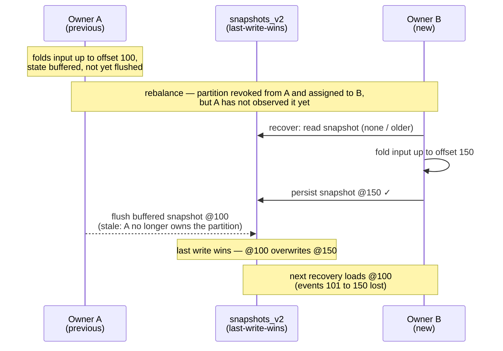
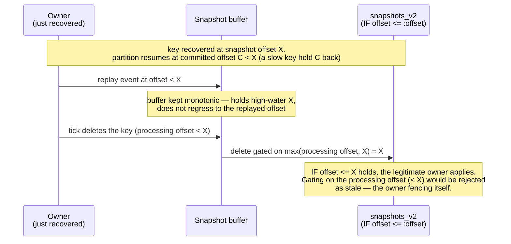

Design notes for the compare-and-set snapshot mode of `kafka-flow-persistence-cassandra`
(`CassandraSnapshots.withSchema(compareAndSet = true)`). User-facing guarantees, costs and rollout
guidance are in [Persistence](persistence.md#protecting-against-stale-snapshot-writes); this page
records the mechanism and its subtleties. The Kafka backend solves the same problem differently — see
[Kafka single-writer design](kafka-single-writer-design.md).

## Problem

[kafka-flow#732](https://github.com/evolution-gaming/kafka-flow/issues/732): consumer-group ownership
of the input topic does not extend to the snapshot store. During a rebalance a previous owner that has
not yet observed the revocation (network issue, GC pause, slow poll loop) keeps folding events and
flushing snapshots alongside the new owner. The snapshots table is last-write-wins, so a stale
snapshot can overwrite a newer one; the next recovery loads stale state and loses the events between
the two snapshots, even though their input offsets were committed. Overlaps of tens of seconds have
been observed in production.



## Mechanism: compare-and-set

The stored offset is a per-key [fencing token](https://martin.kleppmann.com/2016/02/08/how-to-do-distributed-locking.html):
every write asserts that the stored offset is not greater than the one being written, so the
newest-by-offset writer wins regardless of who it is. Unlike Kafka, Cassandra offers a conditional
write (a Paxos lightweight transaction), so the fence is per write rather than a transaction binding
the input-offset commit.

A snapshot write (`CassandraSnapshots.persistCompareAndSet`) is

```sql
UPDATE snapshots_v2 SET ... , offset = :offset WHERE <key> IF offset <= :offset
```

The first write of a key finds no row, so the conditional `UPDATE` does not apply; it falls back to
`INSERT ... IF NOT EXISTS`. If that loses a race to a concurrent insert, the conditional `UPDATE` is
retried once, so the newest snapshot still wins a first-write race. A rejected write raises
`SnapshotWriteConflict` (handled uniformly, see [Persistence](persistence.md#protecting-against-stale-snapshot-writes)).
Result classification (`applied` / newer-stored-offset / row-absent) is shared by persist and delete
in `resolveConditional`; a not-applied result reports the stored `offset` when Cassandra returns it
and treats its absence (or a null) as "row absent".

This first-write path is the one place a persist is **not** a single atomic compare-and-set — it is a
compound of separate Paxos transactions with interleaving gaps. It is still safe by construction: both
`UPDATE`s are offset-gated and `INSERT ... IF NOT EXISTS` only ever writes to an absent cell (nothing to
overwrite), so no interleaving can produce a stale overwrite. The only deviation from the atomic
abstraction is a *spurious* conflict — the retry finding the row gone because a TTL reap (or a
last-write-wins hard delete) removed it between the `INSERT` and the retry — which is benign: the flow
recovers on its next flush.

The guard is per **key** (per row), which is the right granularity: #732 corruption is per key, keys
are independent, and per-key monotonic durability is exactly what prevents it. The conditional write
is linearizable per partition key (Paxos), so concurrent writers to one key are correctly ordered
without relying on clock synchronisation.

## Delete: offset-carrying tombstone

A delete cannot be a plain `DELETE`. Removing the row removes the `offset` guard with it, so a lagging
zombie's `INSERT ... IF NOT EXISTS` at a lower offset would then succeed — resurrecting a stale
snapshot. A later recovery would fold new events onto that resurrected base, silently losing the
delete: #732 reintroduced for that key.

So the compare-and-set delete (`deleteCompareAndSet`) writes an offset-carrying logical **tombstone**

```sql
UPDATE snapshots_v2 SET value = null, offset = :offset WHERE <key> IF offset <= :offset
```

keeping the row (and its `offset`). A stale lower-offset writer is then rejected, not resurrected; a
replayed delete is a no-op (equal offset) or a conflict (a newer write exists), never a resurrection;
`get` reads a null `value` back as `None`. The tombstone is reaped by the TTL, if configured. Keeping
the row also routes the delete through Paxos, avoiding the well-known hazard of mixing lightweight
transactions and regular mutations on the same row.

## The replay window

A delete and a re-persist are fenced on an offset that, just after recovery, can legitimately trail
the key's own stored snapshot. The partition resumes from the committed offset `C` (the minimum offset
still held across all of its keys); a single slow key can hold `C` well below a fast key's durable
snapshot offset `X` (the offset-lags-state invariant only guarantees `C <= X`). On recovery the
partition's processing offset starts at `C`, while the recovered snapshot's offset is `X`.



If, in this window, the owner issues a write for that key:

- a **time-driven tick** that deletes the key would gate the delete on the processing offset `C` —
  `IF offset <= C` against the stored `X > C` rejects it, **crashing the legitimate owner** with a
  `SnapshotWriteConflict` that reads as if another writer owned the key;
- a **periodic flush** during replay would re-derive the snapshot and try to persist it at the
  replayed offset (`< X`) — the same rejection.

Neither is a safety problem (the durable snapshot stays at `X`), but both are a liveness problem: the
owner fences *itself*. The cause is that the in-memory snapshot buffer's offset *regresses* while
replaying events below `X` (`Snapshot.updateValue` treats the offset-only change as a value change).

The fix keeps the buffered snapshot **monotonic in offset**: `Snapshots.append` drops a lower-offset
append rather than regressing the buffer (sound because, under the determinism the design already
assumes, re-folding events `<= X` reproduces the same state — see below). The buffer therefore stays
at the key's high-water `X`, so

- a delete is fenced on `max(currentOffset, highWater)` — the legitimate owner presents `X` and
  applies, while a genuinely stale writer (which only ever *reached* its own lower offset, never `X`)
  still presents that lower offset and stays fenced;
- a re-derived snapshot is not re-persisted below `X` (the buffer stays `persisted`), so the flush is
  a no-op.

Of these two, only the **delete** is irreducible. `SnapshotFold` already drops replayed events
(`record.offset > snapshot.offset`), so a re-derived snapshot below `X` is never even appended — the
monotonic `append` is belt-and-suspenders for the persist case. A **tick-delete** (`TickToState`) is
timer-driven and bypasses that filter, so only the monotonic buffer lets a legitimate tick-delete
apply during replay.

The buffer fence is selected by whether snapshots carry an offset, not by the write mode: the Cassandra
path passes `Some(_.offset)` (via `SnapshotDatabase.snapshotsOf`) in *both* compare-and-set and
last-write-wins modes, so the buffer stays monotonic and a delete presents the key's high-water offset;
a store with no offset passes `None` and is unfenced (e.g. the Kafka backend, which fences at the broker
instead). Presenting the high-water only *rejects* a stale writer where the store gates on it — i.e.
compare-and-set mode; under last-write-wins it is still computed but the plain `DELETE`/`UPDATE` ignore
it. Either way it is surgical: `max(currentOffset, highWater)` differs from `currentOffset` only inside
this replay window.

This fence and the tombstone above are independent and complementary: presenting the higher `highWater`
for a delete makes the tombstone it writes *more* protective against a lower-offset revive, never less.

## Equal-offset writes and determinism

`IF offset <= :offset` admits an *equal* offset, so a stale writer holding exactly the stored offset is
not detected. This is deliberate. The legitimate owner can act at an offset it has already stored: a
tick can change state — or delete — without consuming a new record, and in the replay window above a
tick-delete is fenced on the high-water `X`, which equals the stored offset; a strict `<` would reject
these and fence the owner against itself. Admitting equal is safe not because the new value is identical
but because a same-offset write does not move the recovery point — unlike a lower-offset write it cannot
drop committed events (#732). The *records* folded into any two snapshots at the same offset are the
same, so a same-offset re-persist differs at most in time-driven tick state, never in event data; a
replayed delete is a no-op. Deterministic, replayable folds are therefore a precondition of the CAS
mode (as they already are of recovery generally) — the same property that lets the monotonic buffer
drop a lower-offset replay as a no-op.

## Consistency

The lightweight transaction reaches consensus at the *serial* consistency level, which is distinct
from the read/write levels in `ConsistencyOverrides` and defaults to `SERIAL` (a cross-datacenter
quorum). `ConsistencyOverrides.write` governs only the transaction's commit phase, not its consensus.
For single-datacenter partition ownership (the common case) set the scassandra client's
`query.serial-consistency = LOCAL_SERIAL` to keep the Paxos rounds in-DC; otherwise every conditional
write and delete pays a cross-datacenter round-trip. Recovery reads at `ConsistencyOverrides.read`;
a serial read is not required, because `R + W > N` makes a non-serial read see every committed
snapshot, and a still-in-flight write — one whose `persist` has not completed — is safe to miss
(recovery re-folds from the committed offset).

Compare-and-set does require read and write consistency at `QUORUM` or stronger (so `R + W > N`).
For single-datacenter ownership, `LOCAL_QUORUM` at both levels satisfies `R + W > N` within the
local DC and pairs with `LOCAL_SERIAL`. What matters is access locality — a key's writers and its
recovery read all in one DC — not the replication footprint, which may still span DCs for DR. The
conditional write reaches consensus on a serial quorum but *materialises* at `ConsistencyOverrides.write`;
with a weaker write level a (non-serial) `QUORUM` recovery read can miss the newest committed snapshot
even with no in-flight Paxos, reintroducing #732 on the read side — which the write-side fence does not
heal. This is not a default: `ConsistencyOverrides` is empty unless you set it, so the snapshot table
inherits the session's default level (often `LOCAL_ONE`) — you must configure read and write to a
quorum. Keep `R + W > N` within one consistency domain and a key's Paxos in one DC: the `LOCAL_*` set
is for single-DC ownership, while ownership that can fail over between DCs (or write a key from two
DCs) needs the cross-DC `SERIAL` / `QUORUM` levels.

## TTL and rollout

The `offset` guard lives in the snapshot row, so it expires with the row's TTL. After a row's TTL
lapses the guard is gone and a stale write can land a fresh `INSERT`; this is harmless when the TTL far
exceeds the rebalance/zombie overlap window (the usual case — a zombie outliving the TTL is not
realistic), but the monotonicity guarantee only holds within the TTL.

Without a TTL the offset-carrying tombstone is never reaped, so a deleted key leaves its row behind
indefinitely and the table grows by one row per deleted key. Configure a TTL (comfortably above the
overlap window) for workloads that delete keys.

Enabling on a running system needs no migration (the condition reads the `offset` column every version
already writes). The one rolling-deploy caveat: a lightweight transaction uses a coordinator-generated
write timestamp while a regular write uses a client-side one, so during a mixed deploy an application
clock running ahead of the coordinators can let an old (plain-write) instance's snapshot shadow a newer
conditional one. Negligible with NTP-synced clocks, and gone once every instance writes conditionally.

## Testing

- Store-level against real Cassandra (persistence-cassandra-it-tests) — monotonic writes,
  stale-write rejection, the tombstone (no resurrection, replayed/stale delete, equal-offset),
  idempotent delete, TTL on both the insert and update paths, and concurrent first-writers racing on a
  fresh key (the highest offset wins, no corruption — exercising the first-write retry path).
- Through the real PartitionFlow / eager-recovery / flush-on-revoke machinery
  (persistence-cassandra-it-tests) — the #732 reproduction asserts corruption under last-write-wins;
  the prevention asserts the stale flush is rejected; and a delete during replay below the recovered
  snapshot offset applies (fenced on the high-water), not rejected.
- In core — the monotonic buffer and the delete fence: a unit test directly, and a flow-level test
  against an offset-gated in-memory store.

## Assumptions

This design takes three things as given:

- **Per-key linearizable compare-and-set.** Each Cassandra lightweight transaction on a row is an atomic,
  linearizable operation (Paxos). The first-write `UPDATE`/`INSERT`/retry compound is *not* atomic.
- **Deterministic, replayable folds (a user contract).** Re-folding a recovered base over the same events
  reproduces the same state. This is what makes a lower-offset replay a no-op (so the buffer can stay
  monotonic) and what makes equal-offset writes idempotent. A non-deterministic fold breaks both.
- **Per-key independence.** #732 corruption is per key; keys are independent, so per-key monotonic
  durability is the whole guarantee.

## Rejected alternatives

- **Offset-as-write-timestamp (LWW register)**: write each snapshot `USING TIMESTAMP <offset>` and let
  Cassandra's last-write-wins reconciliation keep the highest-offset cell — a plain quorum write, much
  cheaper than a Paxos round, and a delete becomes a tombstone ordered by offset. Rejected as the
  default: equal-offset replacement breaks (at equal timestamps Cassandra breaks ties by value, not
  write order), a rolling deploy inverts catastrophically (old instances write wall-clock timestamps
  that dominate every offset-as-timestamp value), and it discards the real write timestamps.
- **Lease / ownership table**: a per-partition lease acquired with one LWT, then cheap writes. The
  lease alone does not stop a paused leaseholder's plain writes (last-write-wins still applies), so a
  per-write fencing token is still required — at which point the lease only adds liveness/expiry
  concerns on top of the per-write CAS.
- **Composite `(offset, generation)` token**: gate on the consumer generation as well as the offset,
  closing the equal-offset gap and giving per-partition (not just per-key) ownership. Couples the
  self-contained Cassandra module to the live consumer generation; reasonable as a future strict mode,
  not a default.
- **Recovery-side reconciliation** (store the offset, recover from the lowest): does not prevent the
  stale overwrite (last-write-wins still corrupts), so strictly weaker than fencing the write.

## Forward-looking

[KIP-939 (participation in 2PC)](https://cwiki.apache.org/confluence/display/KAFKA/KIP-939:+Support+Participation+in+2PC)
is the convergence point for the two backends: a transactional Kafka producer in an
externally-coordinated two-phase commit could bind a Cassandra snapshot write to the same
generation-fenced input-offset commit the Kafka backend already uses, giving Cassandra per-partition
ownership without the per-key compare-and-set. Not actionable now; see the Kafka design doc's
forward-looking note.
