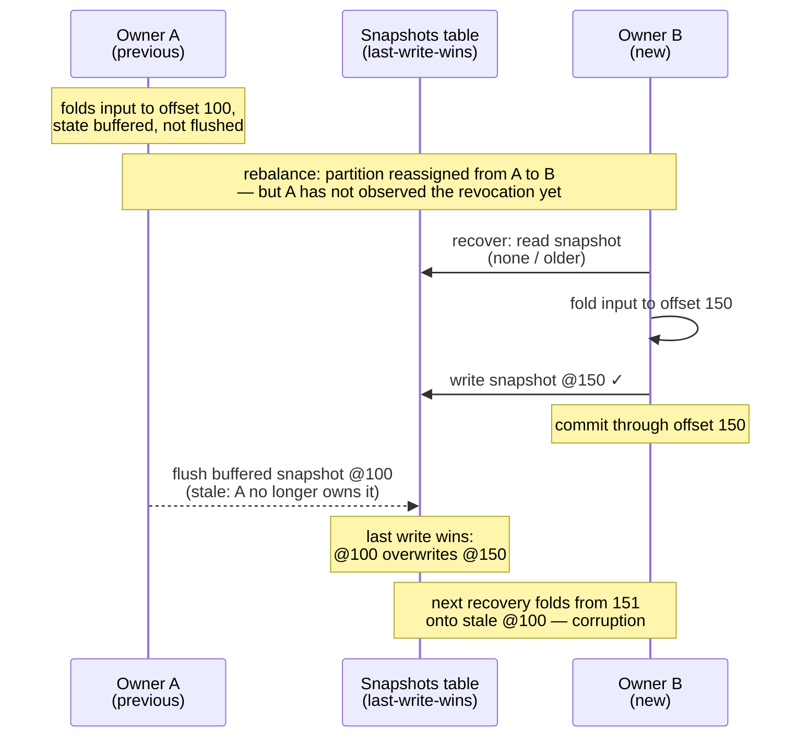
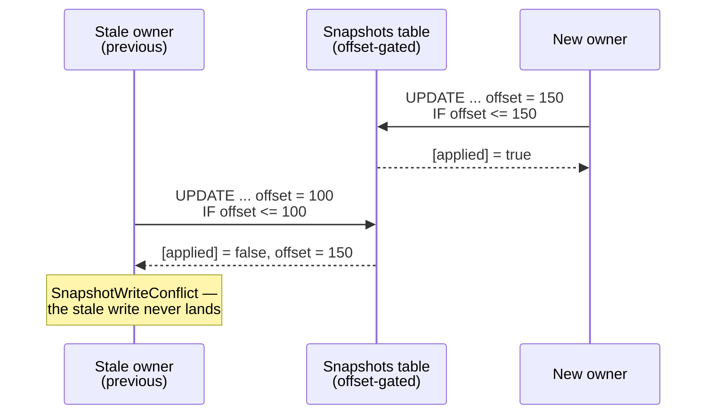

Design notes for the compare-and-set snapshot mode of `kafka-flow-persistence-cassandra`
(`CassandraSnapshots.withSchema(compareAndSet = true)`) — the mechanism and the reasoning around it. What
ships is small: a single conditional predicate on each `persist`, with `delete` left unchanged. The
substance here is why that suffices, and — separately — the delete fence that was designed, TLA+-modelled,
and deferred (the *Conditional deletes* appendix, none of which ships). The Kafka backend solves the same
problem differently — see [Kafka single-writer design](kafka-single-writer-design.md).

## Problem

[kafka-flow#732](https://github.com/evolution-gaming/kafka-flow/issues/732): during a rebalance a
previous owner that has not yet observed the revocation keeps flushing snapshots alongside the new
owner, and the last-write-wins snapshots table lets a stale write overwrite a newer one — the next
recovery then loads stale state and skips the events in between. The
[Kafka design doc](kafka-single-writer-design.md) covers the failure in full; here it is against the
snapshots table:



## Mechanism: compare-and-set

Cassandra has no transaction to bind the input-offset commit to, the way the Kafka backend does — but
it does offer a conditional write (a Paxos lightweight transaction), so the fence is **per write**. The
stored offset is the per-key [fencing token](https://martin.kleppmann.com/2016/02/08/how-to-do-distributed-locking.html):
every persist asserts the stored offset is not greater than the one being written, so the
newest-by-offset write wins, whoever issued it. The write is linearizable per partition key, so
concurrent writers to one key are ordered without relying on clock synchronisation:

```sql
UPDATE snapshots_v2 SET ... , offset = :offset WHERE <key> IF offset <= :offset
```



A key's first write finds no row, so the `UPDATE` does not apply and it falls back to
`INSERT ... IF NOT EXISTS` (retried once via the `UPDATE` if it loses an insert race). This is the one
non-atomic path — a compound of separate Paxos transactions — but it is safe by construction: both
`UPDATE`s are offset-gated and the `INSERT` only writes an absent row, so no interleaving overwrites a
newer snapshot. A rejected write raises `SnapshotWriteConflict` — including a spurious one if a delete
slips between the first-write `INSERT` and its retry (an over-rejection, never corruption, cleared on
the next flush).

The guard is per **key**, the right granularity: #732 corruption is per key and keys are independent,
so per-key monotonic durability is exactly what prevents it. It is also the granularity Cassandra can
actually linearize: the snapshots table's partition key is the full
`(application_id, group_id, topic, partition, key)` tuple, one row per Cassandra partition, and a
lightweight transaction is linearizable only within one partition.

**The fence guards the write path; recovery must still be able to see what it wrote.** Recovery reads
at the ordinary (non-serial) consistency level, so the newest snapshot is guaranteed visible only when
read and write quorums overlap (`R + W > N`). With a too-weak read level every write is still correctly
fenced, yet recovery can miss the newest snapshot — #732 reintroduced on the read side. Consistency
settings, serial consistency and TTL are operational concerns, covered on the
[persistence page](persistence.md#compare-and-set-snapshot-writes-cassandra).

## Scope: persist-only

The shipped mode is exactly the mechanism above and nothing more: **`persist` is offset-gated; `delete` is
untouched** — plain last-write-wins, no new read, no buffer change. So during a rebalance overlap a stale
writer can still erase a newer snapshot, or resurrect a just-deleted key by writing at a lower offset —
#732 for that key. It is a bounded scope, not a correctness hole: a deletion that must be fenced is still
expressible without a gated `delete`, by persisting an offset-carrying *empty* state through the same
fenced path, so a lower-offset zombie write is rejected exactly as for any persist.

Gating `delete` itself is deferred: it would need a source/binary-breaking `delete(key, offset)` API and
recovery machinery — a monotonic buffer with a floor seeded from the tombstone — to avoid a replay-window
livelock. That design is in *Conditional deletes* below. Persist-only is free of the livelock:
`SnapshotFold`'s existing offset dedup keeps a persist from ever re-deriving below its recovered
high-water, so the floor comes for free.

## Equal-offset writes and determinism

`IF offset <= :offset` admits an *equal* offset, deliberately: the legitimate owner can write at an offset
it has already stored — a timer-driven re-flush of the buffered high-water snapshot — and a strict `<`
would reject that and fence the owner against itself. Admitting equal is safe not because the value is
identical but because a same-offset write does not move the recovery point — unlike a lower-offset write,
it cannot drop committed events (#732).
Any two snapshots at the same offset fold the same records, differing at most in time-driven tick state,
so deterministic, replayable folds are a precondition of the mode (as they already are of recovery
generally).

## Implementation

Entry point: `CassandraSnapshots.withSchema(compareAndSet = true)` (or `withCustomSchema`); through
the persistence module, `CassandraPersistence.withSchema`/`withSchemaF` with
`snapshotCompareAndSet = true`. In the current code:

- **Write mode** — `CassandraSnapshots.WriteMode`: `LastWriteWins` (the default, the pre-existing
  unconditional `UPDATE`) or `CompareAndSet(insertStatement)`. The first-write
  `INSERT ... IF NOT EXISTS` statement is prepared exactly when the mode is on, and the ADT carries
  it, so the mode and its extra statement cannot drift apart.
- **The gated persist** — `persistCompareAndSet`: the value is serialized and `created` stamped once,
  reused across the compound; then `UPDATE ... IF offset <= :offset`, interpreted off the lightweight
  transaction's result row. `[applied] = true` — done. `[applied] = false` with the stored `offset`
  column present (Cassandra returns the conditioned columns of an existing row) —
  `SnapshotWriteConflict(key, attemptedOffset, persistedOffset)`. `[applied] = false` with no `offset`
  column — the row does not exist: `INSERT ... IF NOT EXISTS`, and on losing that race one `UPDATE`
  retry; a row deleted between the `INSERT` and the retry surfaces as a conflict with
  `persistedOffset = None` (the spurious over-rejection above).
- **Unchanged surface** — `SnapshotDatabase` keeps its signatures; `get` and `delete` keep their
  statements; with the flag off the prepared statements are exactly the previous ones. Off means off.

## Testing

Integration tests (persistence-cassandra-it-tests) run against a real Cassandra:

- **Store-level** (`SnapshotSpec`): monotonic and equal-offset writes apply, the first write
  exercising the `INSERT` path; a stale write is rejected with the attempted and stored offsets in the
  error; the TTL lands on both the `INSERT` and the `UPDATE` path; and a concurrent first-write race —
  parallel writers on a fresh key, all entering the non-atomic compound at once — ends at the highest
  offset, the losers failing cleanly with `SnapshotWriteConflict`. The persist-only residual gap is
  *pinned* as a test rather than left as prose: an unguarded `delete` lets a lower-offset write
  resurrect the key; if a future mode gates deletes, that assertion flips.
- **Flow-level** (`FlowSpec`): a #732 reproduction/prevention pair through the real machinery
  (`PartitionFlow`, eager recovery, fold, buffered snapshots, flush-on-revoke), the ownership overlap
  simulated by two `PartitionFlow`s over one partition — indistinguishable from a real overlap, where
  the second flow starts while the first is still alive. With `compareAndSet = false` the stale
  flush-on-revoke lands and recovery returns the stale snapshot (the corruption, documented as a
  passing assertion); with `compareAndSet = true` the same stale flush is rejected — surfacing only as
  scache's logged-and-swallowed release error — and the new owner's snapshot survives.

## Rejected alternatives

- **Offset-as-write-timestamp (LWW register)**: write each snapshot `USING TIMESTAMP <offset>` and let
  Cassandra's last-write-wins reconciliation keep the highest-offset cell — a plain quorum write, much
  cheaper than a Paxos round, and a delete becomes a tombstone ordered by offset. Rejected as the
  default: equal-offset replacement breaks (at equal timestamps Cassandra breaks ties by value, not
  write order), a rolling deploy inverts catastrophically (old instances write wall-clock timestamps
  that dominate every offset-as-timestamp value), and it discards the real write timestamps.
- **Lease / ownership table**: a per-partition lease acquired with one LWT, then cheap writes. The
  lease alone does not stop a paused leaseholder's plain writes (last-write-wins still applies), so a
  per-write fencing token is still required — at which point the lease only adds liveness/expiry
  concerns on top of the per-write CAS.
- **Composite `(offset, generation)` token**: gate on the consumer generation as well as the offset,
  closing the equal-offset gap and giving per-partition (not just per-key) ownership. Couples the
  self-contained Cassandra module to the live consumer generation; reasonable as a future strict mode,
  not a default.
- **Recovery-side reconciliation** (store the offset, recover from the lowest): does not prevent the
  stale overwrite (last-write-wins still corrupts), so strictly weaker than fencing the write.

## Forward-looking

- **Offset-gated deletes** — make `delete` safe by default, without the empty-state workaround (see
  *Scope*); the prototyped, TLA+-modelled design is in *Conditional deletes: the deferred design* below.
  Deferred for the source/binary-breaking `delete(key, offset)` API and the recovery machinery — a
  candidate for a future major version.
- **Per-partition ownership** — the equal-offset gap and per-key (rather than per-partition) granularity
  could be closed by a composite `(offset, generation)` token (see Rejected alternatives) or, further out, by
  [KIP-939 (participation in 2PC)](https://cwiki.apache.org/confluence/display/KAFKA/KIP-939:+Support+Participation+in+2PC):
  a transactional producer in an externally-coordinated two-phase commit could bind the Cassandra
  snapshot write to a generation-fenced Kafka input-offset commit, giving Cassandra per-partition
  ownership without the per-key compare-and-set. Not actionable now; see the Kafka design doc's
  forward-looking note.

## Conditional deletes: the deferred design

**None of this is in the shipped mode.** Fencing deletes was designed and TLA+-modelled, then deferred in
favour of persist-only; everything below — the tombstone, the `recover` read, the buffer floor, the
recovery changes — is that deferred design. It follows from a single goal — fence a delete the way a
persist is fenced, on its offset — with each part forced by the one before it:

**A delete cannot remove the row.** Removing the row removes the `offset` guard with it, so a lagging
zombie's `INSERT ... IF NOT EXISTS` at a lower offset would then succeed and resurrect a stale snapshot —
#732 for that key. A fenced delete is therefore a logical **tombstone** — the row kept with its `offset`,
value nulled, on the same offset-gated path as a persist:

```sql
UPDATE snapshots_v2 SET value = null, offset = :offset WHERE <key> IF offset <= :offset
```

A lower-offset writer is rejected, not resurrected; a replayed delete is a no-op (equal offset) or a
conflict, never a revival. Keeping the row also holds the delete on the Paxos path, avoiding the hazard of
mixing lightweight transactions and plain mutations on one row.

**A monotonic buffer, or the owner fences itself.** In the replay window a key can be recovered at its
durable offset `X` while the partition resumes from a lower committed offset `C` (a slow key held `C`
back). If the buffer regressed to a replayed offset `< X`, a tick-delete or flush would write below `X`,
`IF offset <= X` would reject it, and the fence would crash the *legitimate* owner. So the **per-key**
buffer is kept monotonic in offset — a lower-offset write dropped, a tombstone lifted to
`max(write offset, that key's high-water)` — and a delete is gated on that key's high-water `X`, which
the true owner presents and a genuinely stale writer (which only ever reached its own lower offset) does
not. This is sound under the determinism the design already assumes: re-folding events `<= X` reproduces
the same state.

**Re-seed the floor on recovery — on both paths, and the second is easy to miss.** The base read is
`get`, typed `Option[S]`: it returns *a value* or *nothing*, never *deleted at offset `X`*. A tombstone
therefore comes back through `get` as a plain `None`, indistinguishable from a never-written key, so
recovery sets no floor — the buffer climbs from the replayed offsets `< X`, the offset-`X` tombstone
rejects the owner, and the flow livelocks (tear down → re-recover the floorless tombstone → repeat). The
fix is a *new* recovery read that surfaces the offset — `recover`, returning `Deleted(offset)` where `get`
returns `None` — to seed the floor.

That repairs **snapshot** recovery. **Events-recovery** re-opens the same livelock on its own: it rebuilds
state by folding the *journal*, not by reading the snapshot store, and a delete *clears the journal*, so
the fold yields nothing and the floor is lost again — a path the snapshot-recovery fix never touches. It
must seed the floor from the snapshot store separately (a read for its side-effect) before folding. **A
delete fence that seeds the floor only on snapshot recovery still livelocks on events-recovery** — the two
seedings are independent, and the events-recovery one fires only for a deleted key (a live key's journal
reconstructs `X` itself).

**What the model proved.** The livelock was modelled in TLA+ as a checked negative control: with the
monotone buffer or the tombstone floor removed, liveness fails while safety still holds (a rejected write
changes nothing; `X` never regresses) — a pure liveness failure, reached through a live snapshot in one
configuration and through a deleted key in another. With both in place the specification refines an
abstract single-writer store for safety **and** liveness. The deleted-key case needs its *own* floor fix
precisely because the tombstone reads back as absent — which is also why persist-only is livelock-free:
re-deriving below the high-water is the everyday persist case `SnapshotFold` already covers.
