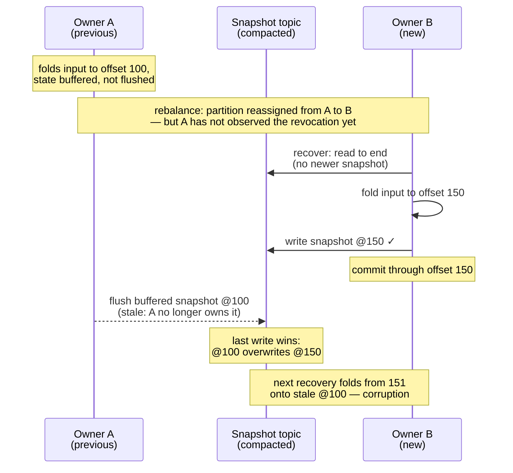
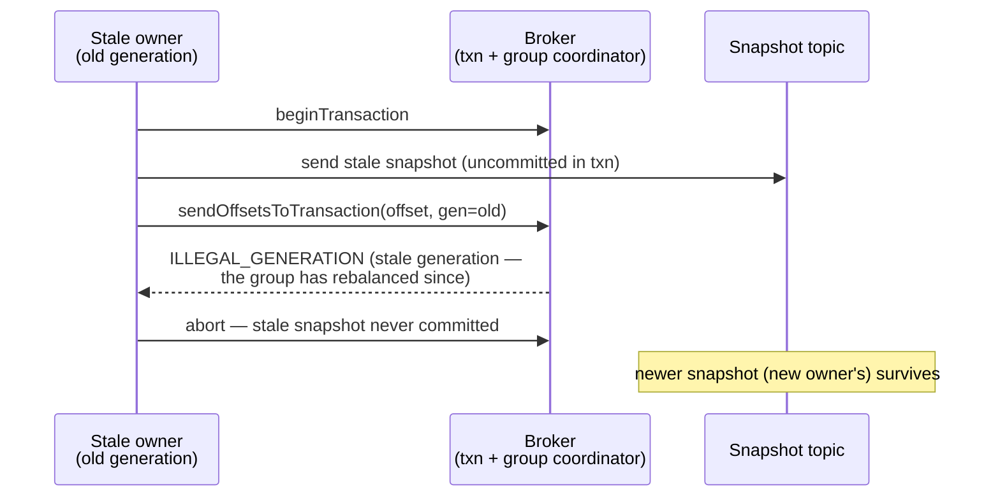

Design notes for the transactional snapshot mode of `kafka-flow-persistence-kafka`
(`KafkaPersistenceModuleOf.cachingTransactional`) — the mechanism and the measurements behind it.

## Problem

[kafka-flow#732](https://github.com/evolution-gaming/kafka-flow/issues/732): consumer-group
ownership of the input topic does not extend to the snapshot topic. During a rebalance a previous
owner that has not yet observed the revocation (network issue, GC pause, slow poll loop) keeps
writing snapshots alongside the new owner — overlaps of tens of seconds have been observed in
production. The snapshot topic is compacted (last-write-wins), so a stale snapshot can overwrite a
newer one; the next recovery then loads stale state but resumes from the committed offset, so the
events between the two snapshots are never re-folded — corrupting the state.

## Mechanism: generation fencing

In the default (non-transactional) mode the input offsets are committed through the **Kafka consumer**
(the ordinary consumer-group offset commit). In this mode they are committed through the snapshot
**producer** instead, with the consumer-side commit disabled — the offset moves **into the producer's
transaction** via `sendOffsetsToTransaction(offsets, consumerGroupMetadata)`
([KIP-447](https://cwiki.apache.org/confluence/display/KAFKA/KIP-447%3A+Producer+scalability+for+exactly+once+semantics)):
the metadata carries the consumer's **generation**, so the group coordinator validates it and rejects a
stale one (`ILLEGAL_GENERATION`, surfaced to the client as `CommitFailedException`). Brokers 2.5+ are
required — KIP-447's `TxnOffsetCommit` v3 is what carries the generation to the coordinator at all.
Since that commit and the snapshot writes share a transaction, the rejection aborts the writes too.
The generation gates both, so a stale owner can neither advance offsets nor overwrite a newer snapshot.

The mechanism combines two ideas — a distributed lock, and a transactional snapshot
write + offset commit. Kafka's consumer group is the lock, and it already provides both an ownership
*lease* and a [fencing token](https://martin.kleppmann.com/2016/02/08/how-to-do-distributed-locking.html):
the partition assignment is the lease, and the **generation** (bumped on each rebalance) is the token.
What is missing by default is only the link: the snapshot write is not bound to the fenced offset
commit. Binding them in one transaction is the link.

This is corruption prevention, not exactly-once. Output produces go through the application's own
producer, and the transaction wraps only the snapshot write and the offset commit, so they stay outside
it — enrolling them would be full transactional output, an explicit non-goal (see Rejected alternatives).
Output is therefore at-least-once: a replayed batch re-emits it, so the consuming side must tolerate
duplicates. The **committable offset** — the minimum offset still held across the partition's keys, or,
once nothing is held, the offset just past the last processed record — is
never ahead of the persisted snapshots: an offset becomes committable only after its snapshot is
persisted, so recovery never skips events.

Key points:

- **Every** transaction commits the partition's current committable offset, so every write is gated. The
  offset itself advances only on the periodic offset-commit interval (`commitOffsetsInterval`, separate
  from the snapshot-flush interval `persistEvery`) or, opt-in, on revoke (`PartitionFlowConfig.commitOnRevoke`,
  off by default); a snapshot write never advances it, it
  just re-commits the current value to stay gated. That advance is committed in a transaction — batching
  in any snapshot writes queued at that moment, or committing the offset alone (an *offset-only*
  transaction) when there are none.
- The offset-to-commit is **seeded with the assigned offset**, so even the first snapshot flush (before
  the first commit tick) carries an offset and is gated.
- Recovery is forced to `read_committed` so a fenced writer's aborted records are invisible.
- The ordinary consumer-group offset commit is **replaced**, not run alongside. In the default mode the
  committable offset is staged and the **consumer** commits it; in this mode that same offset-scheduling
  step is rerouted to the **producer**, so the offset is committed only inside the transaction (above).
  The consumer-commit path still runs each poll cycle but now finds nothing staged — a no-op — so the
  partition is never committed through the consumer.
- Both the write and the offset-only commit are **synchronous** — there is no background committer, so
  the call itself drives the transaction and blocks on its outcome. That blocking is what lets a fence
  (`CommitFailedException`) propagate into the flow and crash a stale owner, rather than being lost on a
  fire-and-forget commit thread.
- The fence is per **member + generation**, not per partition: the coordinator checks the committer's
  generation, not which partitions it still owns, so a member still on the current generation cannot be
  stopped from committing a partition it just lost. (KIP-1251's per-partition assignment epoch, below,
  does not close this — it applies only to lagging commits.) That is closed client-side: a revoked partition's
  flows are torn down inside the synchronous revoke callback, and the broker does not reassign the
  partition until the client acknowledges the revocation — which it cannot do until that callback
  returns. So while the member stays in the group, no new owner exists while a flow for the partition is
  still alive (the await is pinned by a unit test; see Testing). The one way out is eviction — teardown
  stalling past the rebalance timeout, the partition reassigned over still-live flows — which only swaps
  the net: an evicted member is removed from the group, so those commits fail member validation
  (`UNKNOWN_MEMBER_ID`, the same abortable `CommitFailedException`). Nothing relies on the timeout never
  firing.

The mechanism needs the input topic-partition and a reader of the driving consumer's group metadata
(`Consumer.groupMetadata`, refreshed after every poll on the poll thread). Both are supplied by the flow
from the partition assignment — not configured by hand — so they always match the consumer that drives
the flow. A fence surfaces as `CommitFailedException` on the failing snapshot write (or offset-only
commit).

A generation captured once at assignment would miss a routine case: a rebalance can advance the
generation while leaving this member's partitions unchanged. The capture would go stale, and the
retained partition's next transactional commit would be spuriously fenced though the member still owns
it — crashing a still-valid owner: safe (a fenced commit writes nothing), but not stable. Refreshing
after every poll avoids it: a post-poll read follows the silent bump a rebalance callback does not.

The `generationId >= 0` guard rejects any negative id, not one specific value — matching the
coordinator's gate, which is also a range: a transactional commit with an empty member id and *any*
negative generation is treated as pre-KIP-447 input, for which generation validation is **skipped** — it
would land unfenced. (The current coordinator keeps the skip for the newer consumer protocol too,
narrowed to the unknown `−1` — KAFKA-18060; every skipped shape stays inside the guarded range.) In practice the only negative the client reports is the unknown pre-join
value: after falling out of the group it does not reset back to unknown but keeps the last generation it
joined, so a fallen-out owner stays fenced by its own stale token. Dropping the pre-join value leaves the
tracked metadata empty until the first join completes, and a flush in that window — unreachable on the
flow path — fails loudly rather than committing ungated.

### Epoch fencing as takeover-abort

Safety rests on generation fencing alone; producer-epoch fencing is employed for a different job. Each
partition's producer has a **stable** `transactional.id` (`"{prefix}-{partition}"`, the Kafka Streams
model), so a takeover's `initTransactions` bumps the producer epoch: the previous owner's producer is
fenced — a wedged stale owner fails fast on its first use (`ProducerFencedException`) instead of a
transaction later at the offset-commit fence — and **any transaction it left open is aborted on the
spot**. That abort is the reason for the choice: a hard-crashed owner's dangling transaction otherwise
survives until `transaction.timeout.ms` and pins the snapshot topic's last-stable-offset — the horizon
`read_committed` readers (recovery included) cannot see past. The stable id makes that pin harmless by
construction: every writer of a partition shares its id, and a producer's **mandatory**
`initTransactions` aborts the predecessor's open transaction before the producer may write, so the
partition's transactions are serialized — a committed snapshot never sits above an open one. Recovery
therefore bounds its read at its own `read_committed` end offset (the last-stable-offset) and that
bound is *complete*, with nothing to wait out; the one pin it does not cover is a foreign producer's
transaction on the snapshot topic, a deployment already excluded (sharing a snapshot topic mixes state
on recovery regardless of any read bound). Kafka Streams has to solve the same problem the other way
around ([KAFKA-10167](https://issues.apache.org/jira/browse/KAFKA-10167)): its eos-v2 per-process ids
leave a crashed instance's transaction unabortable, so its restore reads to the *high watermark* and
waits pins out, with the transaction timeout forced down to 10 s to shorten them. The stable
per-partition id — Streams' own removed eos-v1 model, affordable here because there is a producer per
partition anyway — is what makes both the wait and the extra bound unnecessary. (The same init that
aborts the dangling transaction also resolves its pending transactional offsets — the abort markers
land on `__consumer_offsets` too — so the next owner's `requireStable` offset fetch is equally
unaffected; a crashed owner's leftovers are gone before anything of this design reads past them.) A
recovery read stalled far beyond any transient hiccup fails loudly (`RecoveryReadStalledError`) instead
of hanging: with every record below the target decided, the remaining cause of a stall is log
truncation. The threshold sits below `max.poll.interval.ms` deliberately — recovery runs on the poll
thread inside the rebalance callback, so a silent hang would not crash anything: the broker would evict
the member around the stuck thread, invisible to process-level health checks; failing first turns that
into a visible flow error.

No safety is asked of the epoch fence, and none should be: the generation bound into every commit is
what fences stale owners, and in a rare corner the epoch order can even invert ownership — a stale
owner whose `initTransactions` stalls across an immediate follow-up rebalance fences the true owner
(one crash of a valid owner; self-healing; safety unaffected). Two operational notes: treat the id
prefix like a group id — unique per application on the cluster, or applications fence each other's
producers — and stable ids keep transaction-coordinator state bounded (no per-assignment id
accumulation against `transactional.id.expiration.ms`).

## Consumer rebalance protocols

The per-member fencing token is the **generation** under the classic protocol and the **member epoch**
under the consumer protocol
([KIP-848](https://cwiki.apache.org/confluence/display/KAFKA/KIP-848%3A+The+Next+Generation+of+the+Consumer+Rebalance+Protocol),
GA in Kafka 4.0, selected by `group.protocol=consumer`); they play the same role, and below *generation*
stands for both. (KIP-1251, below, adds a separate per-partition *assignment epoch*.) The fence works under
both: it never depends on a rebalance callback — the generation is tracked by the post-poll read
(above) — and the broker-side fence holds under each.

Why a callback would miss the silent bump (above) is protocol-specific: under the consumer protocol the
epoch advances on the background heartbeat thread and fires no rebalance callback at all; under the
classic protocol's **cooperative** assignor it fires an `onPartitionsAssigned` with an empty delta that
the typed listener drops
([skafka#581](https://github.com/evolution-gaming/skafka/issues/581)); only the classic **eager** assignor
re-delivers the full assignment a callback could see — and relying on that would not port to the other
two. The post-poll read observes it under all three: classic eager, classic cooperative, and the
consumer protocol.

Under the **classic** protocol that read is nearly sufficient on its own: *completed* generation
advances land in the group metadata only inside `poll` (a background fence or leave does not touch it —
the client keeps reporting the last joined generation, which can only self-fence), so the post-poll read
observes every completed advance before the flush that follows. What remains is the in-flight round: a
join round can span polls (KIP-266), the broker bumps the generation when the join phase completes, and a
flush of a retained partition between that bump and this member's sync still carries the previous
generation — spuriously fenced, on any broker version, and absorbed by nothing; safe, but the
still-valid owner crashes. Under the **consumer** protocol the epoch additionally advances on the
background thread *between* polls with no round in flight at all, so even a post-poll read can be stale
by the time the commit reaches the broker; the read narrows that window but cannot fully close it — the
same liveness cost, never a safety one (a lagging token only fences).

The between-polls residual is **consumer-protocol only**, and it is what
[KIP-1251](https://cwiki.apache.org/confluence/display/KAFKA/KIP-1251%3A+Assignment+epochs+for+consumer+groups),
a broker-side coordinator change in Kafka 4.3.0, absorbs: it relaxes the offset-commit epoch check for a
still-owned partition, so a retained partition's lagging commit is accepted rather than rejected. That is
why the consumer protocol carries a **broker** version floor and the classic protocol does not: below
4.3.0 the consumer-protocol residual is not absorbed and crashes the still-valid owner —
safe, but not stable — so brokers 4.3.0+ are recommended for `group.protocol=consumer`; the classic
in-flight-round residual is absorbed by no broker version, so there is no version to prefer.

The revoke-time flush is a separate case, and the one place the three differ in outcome. Classic
**eager** revokes before the member rejoins, so the flush commits under the still-valid generation and
lands. The **consumer** protocol reaches the same outcome differently: the coordinator keeps the member
on its epoch until it acknowledges the revocation, and the flush runs before that acknowledgement. Only
classic **cooperative** fences it: the member is already on the new generation by revoke time, so the
flush — carrying the generation from the prior poll — is rejected (safe; the new owner replays). All
three assume the member is still in the group at flush time; one evicted meanwhile is rejected
regardless — the same safe direction.

## Write path: group-committed transactions

A producer allows one transaction at a time, while kafka-flow flushes a partition's keys in
parallel — and after a fresh assignment most of the active key population flushes in one wave per
`persistEvery`. Writes are therefore **group committed**: a write is queued, and the first writer to
take the per-partition transaction lock drains the queued writes at that moment — up to the cap below —
into a single transaction (offset commits ride along without consuming the cap) and delivers the outcome
to each waiter. No batching delay — a lone write commits immediately; a batch is whatever accumulated
during the previous transaction's flight.

`maxWritesPerTransaction` (default 256) caps the batch. Transactions are serial — the next cannot
begin until the current commits — so a partition's sustained write rate ≈ cap / transaction time.
Raising the cap past the default gains little (uncapped measured ~7% faster, below): transaction time
grows with the batch. The cap's job is to bound transaction duration (commit within
`transaction.timeout.ms`, default 1 min) and bytes (≈ cap × snapshot size).

A snapshot write does not complete until its transaction commits, and the flush awaits each write, so
the source is back-pressured: outstanding writes are bounded by the flush concurrency (one per live key
in the wave), not by internal buffering.

## Implementation

Entry point: `KafkaPersistenceModuleOf.cachingTransactional`. In the current code:

- **Group-committed transactional writes** — `KafkaSnapshotWriteDatabase.transactional` (the
  `GroupCommit` machinery); the per-partition transactional producer is built in `KafkaPersistenceModule`.
- **Offset commit** (on the periodic tick / on revoke with `commitOnRevoke`; an offset-only transaction when no snapshot
  writes are pending) — `ScheduleCommit`.
- **Consumer-commit reroute** — at wiring the module's `scheduleCommit` (the transactional `ScheduleCommit`)
  overrides the default consumer-backed one (`kafkaPersistenceModule.scheduleCommit.getOrElse(...)` in the
  persistence-kafka `package` object). That bypasses the default path, where offsets are normally staged
  through `PendingCommits` and committed by `TopicFlow.commitPending` via `consumer.commit`; with nothing
  staged, it commits nothing (a no-op).
- **Generation currency** — the `Consumer` wrapper holds `groupMetadata` in a `Ref`, refreshed after every
  poll.

## Measurements

From `TransactionalWriteThroughputSpec`: single-node testcontainers broker on localhost, replication
factor 1, no network latency — a *floor*; expect a few ms per transaction against real brokers. Each
number is the min of 3 runs on a fresh state topic. Read them as orders of magnitude.

**Experiment A** — 500 keys, small snapshots, one partition, cap held at the default (256); the only
thing that varies is whether the writes are issued one at a time (sequentially) or all at once
(concurrently):

| Mode | Issued | Result |
|---|---|---|
| Shared batched producer (default, no transactions) | one at a time | 197 ms |
| Group-committed transactions | one at a time | 879 ms (500 txns, ~1.8 ms/txn) |
| Group-committed transactions | all at once | 13 ms (a few batches) |

This isolates one variable: group commit only pays off when writes are issued together. Issued one at a
time, nothing batches, so transactions run one per write — several times slower than the plain producer;
issued all at once, they collapse into a few transactions and that cost is gone. The plain producer is
measured one-at-a-time only as a reference point — not a fair head-to-head, since nothing makes it batch
here. The fair comparison, both issued concurrently against realistic payloads, is Experiment B.

**Experiment B** — 2000 keys, 10 KiB snapshots, flushed **concurrently** (the *post-assignment wave*: a
new owner recovers all its keys, so they fall due together, and the timer tick fans the per-key flushes
out concurrently — `parTraverse` across keys in `PartitionFlow`, which the test mirrors). The cap bounds
writes per transaction, so the transaction count is ≈ `N / cap`:

| Configuration | ≈ transactions | Result |
|---|---|---|
| Shared batched producer (baseline) | — | 282 ms |
| `maxWritesPerTransaction = 1` | 2000 | 4 002 ms |
| `maxWritesPerTransaction = 16` | 125 | 513 ms |
| `maxWritesPerTransaction = 256` (default) | ≈ 8 | 300 ms |
| `maxWritesPerTransaction = 2000` (uncapped) | 1 | 279 ms |

Cost tracks the transaction count until Kafka's network batching floors it (~280–300 ms). At the
default cap the burst is within ~6% of the plain baseline; at cap = 1 (a transaction per write) it is
an order of magnitude slower — multi-second poll-path stalls at realistic key counts.

Reproduce: `KAFKA_FLOW_PERF=1 sbt "persistence-kafka-it-tests/testOnly *TransactionalWriteThroughputSpec"`
(the suite is excluded from the default run).

## Testing

Integration tests (`TransactionalKafkaPersistenceSpec`, in persistence-kafka-it-tests) run through the
real eager-recovery (every key recovered on assignment) and flush-on-revoke machinery. The reproduction
shows corruption with the plain shared producer (no offset binding); the prevention drives a stale owner
with an *older consumer generation* and asserts the newer snapshot survives — isolating the offset
binding as the cause, not incidental fencing. Other cases covered: first-flush gating (the seed), a
fenced writer fails its next flush and its aborted transaction neither blocks nor leaks into recovery,
concurrent-write safety. The recovery read's bound rests on the takeover-abort, and that is pinned at
the handover: an owner crashes mid-transaction under the partition's own stable id with a deliberately
long transaction timeout, and immediately after module acquisition the last-stable-offset must be back
at the high watermark — only the takeover-abort can pass that, never the broker's timeout — then
recovery returns the committed snapshot and excludes the dangling record (this also pins the
`{prefix}-{partition}` id format against regression: unique ids would leave the transaction open and
fail the assertion). `ReadSnapshotsSpec` (unit, stubbed consumer) covers the read loop itself: it drains to the consumer's
end offset, and a read stalled far beyond any transient hiccup (a target above a truncated log) fails
with `RecoveryReadStalledError` rather than hang or complete short. And `KafkaPersistenceModuleSpec` (unit) pins the module-owned producer
settings — the stable id shape and idempotence — against whatever `producerConfig` carries. The
group commit is exercised in isolation by `GroupCommitSpec`, a unit test
with a recording in-memory producer (no broker). The teardown-await the fence depends on for just-lost
partitions (Mechanism, last key point) is pinned by `TopicFlowSpec` "remove awaits the flow teardown",
so a refactor to fire-and-forget teardown fails the build rather than silently reopening the gap.
`ConsumerSpec` pins the tracking read itself: metadata is published only by a poll (a bump with no
callback is observed on the next poll, and not before), and the guard drops negatives while keeping the
last joined generation — including that `0` is admitted, the range check rather than a `−1` test.

## Rejected alternatives

- **Transactional snapshot read + snapshot write**: fence a stale writer with a compare-and-set on the
  stored offset. Kafka has no conditional produce primitive, so it cannot be atomic.
- **Unique per-assignment `transactional.id` (no epoch fencing)**: immune to the init-order corner and
  collision-proof by construction, but a hard-crashed owner's dangling transaction then survives until
  `transaction.timeout.ms` — nobody's `initTransactions` ever aborts it — pinning the snapshot topic's
  last-stable-offset on every crash. Recovery would then need the Kafka Streams restore shape (a
  high-watermark target through an uncommitted-isolation lens, waiting pins out — KAFKA-10167), because
  its own `read_committed` end offset would silently under-read committed snapshots above the pin.
  Safety is identical either way (the generation fence); the stable id turns the wait and the extra
  bound into a takeover-abort (see Epoch fencing as takeover-abort).
- **Static partition assignment** (`assign()` instead of `subscribe()`): no consumer group, so no
  rebalance, no overlap window, no fence needed — but it gives up automatic failover and elastic
  reassignment, and safe *dynamic* assignment is the point of this design. (Static *membership*
  ([KIP-345](https://cwiki.apache.org/confluence/display/KAFKA/KIP-345%3A+Introduce+static+membership+protocol+to+reduce+consumer+rebalances))
  is not a substitute: it suppresses rebalances only for graceful restarts within `session.timeout.ms`,
  and does not fence a stuck owner whose session expired.)
- **Transaction per write**: correct but O(keys) round-trips on the poll path (cap = 1 above).
- **Unbounded batches**: ~7% faster, but transaction duration scales unbounded against the coordinator
  timeout.
- **Transactional output produces (full exactly-once)**: out of scope; output stays at-least-once.
- **Capturing the generation in a rebalance callback** (instead of the post-poll read): the bump that
  matters fires no callback the typed listener can act on under the consumer protocol or the classic
  cooperative assignor, and relying on the classic eager full re-delivery would not port to the other
  two (see Consumer rebalance protocols); only a post-poll read observes it under all three.

## Forward-looking

[KIP-939 (participation in 2PC)](https://cwiki.apache.org/confluence/display/KAFKA/KIP-939:+Support+Participation+in+2PC)
is the route to extend this fence to non-Kafka snapshot stores: a transactional producer in an
externally-coordinated two-phase commit could bind a snapshot write in another store (e.g. Cassandra or
an RDBMS) to the same generation-fenced Kafka offset commit, giving that store the per-partition
ownership guarantee this mode has. Not actionable now.
